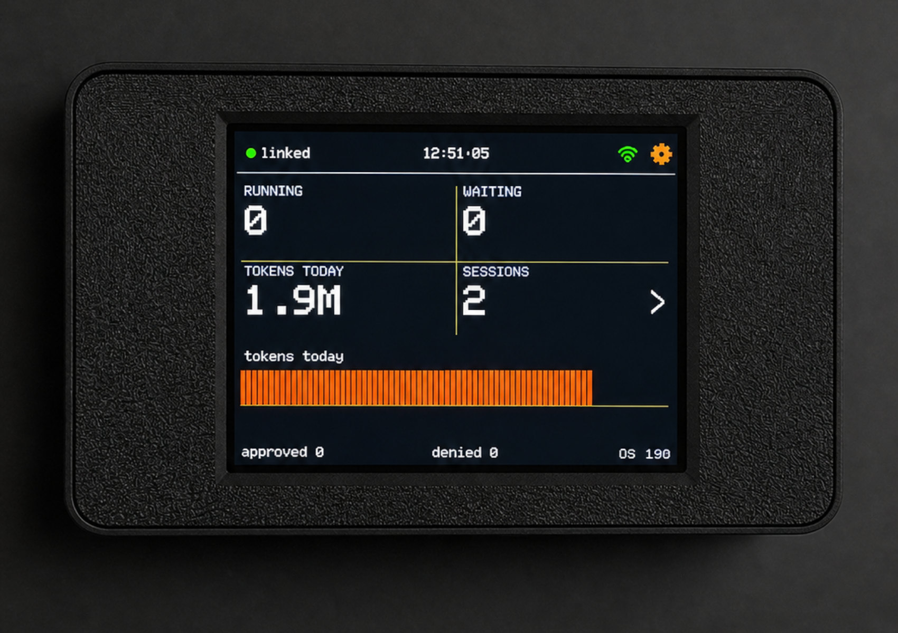
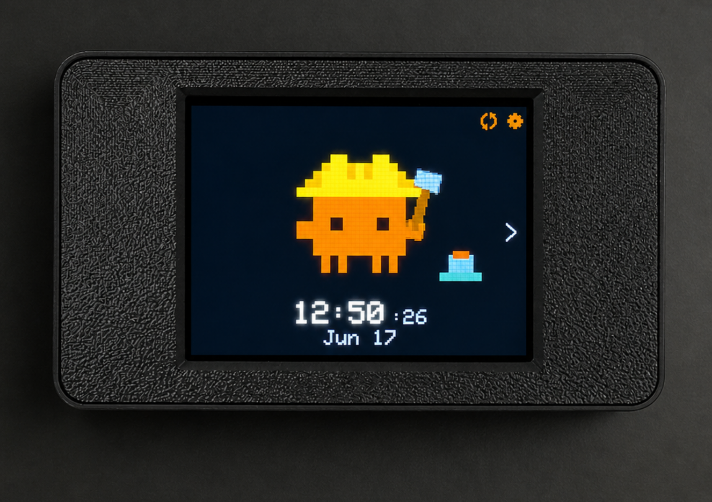
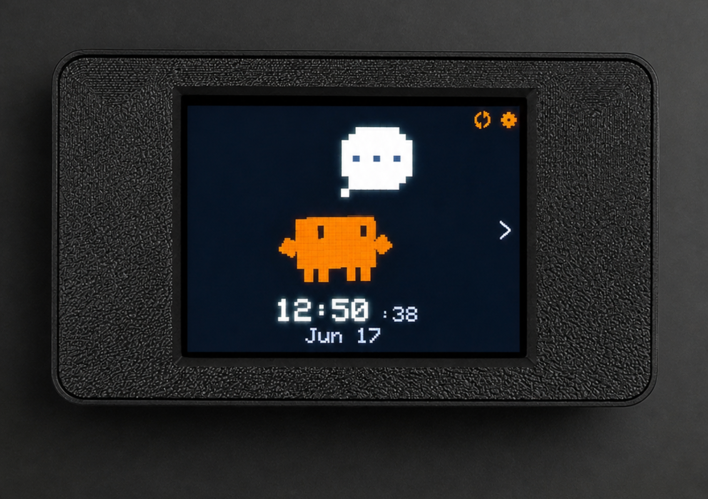

<!--
  This is the PUBLIC-FACING README for nateschnell/agent-buddy.
  The public repo owns its own README (it is NOT overwritten by the release
  mirror), so edit it there directly. Replace the asset placeholders below
  (logo, hero GIF/screenshot) before publishing — see the ASSET notes below.
-->

<!-- ASSET: add a 128px logo at assets/logo.png, then uncomment the block below.
<p align="center">
  
</p>
-->
<h1 align="center">Agent Buddy</h1>
<p align="center">
  <b>A little desk companion for your AI coding agents.</b><br>
  Watch what Claude Code (and a dozen other agents) is doing — live — as an
  animated buddy <b>right on your desktop, no hardware required</b>. See when it's
  thinking, running tools, or waiting on you, and let the buddy celebrate when a
  long task finishes. Add the optional touchscreen device for the full on-desk
  experience.
</p>

<p align="center">
  <a href="https://github.com/nateschnell/agent-buddy/releases"></a>
  
  <a href="LICENSE"></a>
  <a href="https://github.com/nateschnell/agent-buddy/stargazers"></a>
</p>

<p align="center">
  
</p>

Agent Buddy turns the invisible work your AI coding agent does into something you
can *see*. A small background daemon on your machine listens to your agent's
activity through its hook system and brings a little buddy to life — **as an
animated character right on your desktop, with no hardware needed.** It reacts in
real time to what your agent is doing: idle, thinking, running tools, waiting on
you, or done. Start a long task, walk away, and glance over when the buddy
celebrates to tell you it's finished — or needs you.

**The free desktop app is the whole product on its own.** Want a physical
presence on your desk too? The *optional* Agent Buddy hardware — a tiny
touchscreen — adds a full two-column telemetry dashboard, tap-to-approve tool
calls, and an ambient RGB glow you can read from across the room. The same daemon
drives both; the device just makes it tangible.

**This repository is the open-source software side of Agent Buddy:** the
cross-platform desktop app and the `agent-buddy` daemon that bridge your agents to
the device. It's MIT-licensed and built to be inspected — the daemon wires hooks
into your agent configs and reads your session activity, so you should be able to
read exactly what it does. (The device firmware is closed-source and lives in a
separate repository; you don't need it to use, audit, or contribute to anything
here.)

> Works on **macOS**, **Windows**, and **Linux** — **no hardware required**. The
> optional Agent Buddy device adds the full on-desk experience.

## Features

### Desktop buddy — no hardware needed
A floating, animated character lives on your desktop and reacts to your agent in
real time — thinking, running tools, celebrating a finished task, or dozing off
when idle. It's a frameless, always-on-top window you can drag anywhere and toggle
from the app's tray menu or Settings.

- **The free desktop app is fully useful on its own** — install it and you have a
  working buddy in seconds, no device to buy or pair
- **Customizable** — pick the character / animation pack and palette
- **The same engine drives the optional hardware device**, so you can start free
  and add the physical display later

### Multi-agent support
One daemon tracks every supported agent at once, each session resolved
independently and surfaced on the device.

- **Claude Code** — full integration via Claude Code's hook system, including
  live **tool-approval bubbles** on the device
- **Qwen Code** and **CodeBuddy** — live state **plus** on-device tool approvals
- **Codex CLI**, **Gemini CLI**, **Copilot CLI**, **Cursor Agent**, **Kiro CLI**,
  **Kimi Code CLI**, **Antigravity CLI (agy)**, **opencode**, **Pi**,
  **OpenClaw**, and **Hermes Agent** — live activity + session telemetry on the
  device (these keep tool approvals in their own terminal/TUI)
- **Run them side by side** — multiple agents at once all drive the same buddy

> Each agent's hooks are reconciled automatically on install and on every daemon
> start — added when missing, repaired when stale, and **never** duplicated. Your
> own non-buddy hooks are always left untouched.

### Live telemetry on the device
- **Real-time state** — the buddy reacts to what your agent is doing: idle,
  thinking, running tools, working through subagents, waiting on you, or done
- **Session dashboard** — tokens used, context window remaining, and current
  activity, on a two-column landscape display
- **An RGB indicator + ambient presence** — a glance from across the room tells
  you whether your agent is busy, blocked, or finished

### Tap-to-approve
- **On-device permission prompts** — when Claude Code (or Qwen Code / CodeBuddy)
  requests a tool it needs approved, the buddy surfaces it on screen
- **Approve or deny with a tap** — answer on the device instead of switching back
  to the terminal; answer in the terminal first and the prompt clears itself

### One-click setup & updates
- **Self-installing** — open one file; the app installs the background service and
  wires your agent hooks on first run. No config files to edit
- **Over-the-air firmware updates** — the app flashes new device firmware
  wirelessly with one click, and only nudges you when there's actually a newer
  image
- **Self-updating app** — a signed, in-place update on macOS; a guided download
  elsewhere
- **Clean uninstall** — one command (or the tray menu) removes the hooks, the
  daemon, the service, and all local state. The device is never touched

### Built to trust
- **Fully open source (MIT).** The part that touches your machine is the part you
  can read
- **Local-first.** Your session activity goes from your agent to your daemon to
  your device over Bluetooth. Nothing about your sessions is sent to us
- **Signed & notarized** on macOS, so it opens without a Gatekeeper warning

## Quick Start

Download the latest installer from
**[GitHub Releases](https://github.com/nateschnell/agent-buddy/releases/latest)** —
one self-contained file per platform that bundles the app, the background daemon,
and the device firmware images:

- **macOS** — universal `.dmg` (Apple Silicon + Intel), signed & notarized
- **Windows** — `Setup.exe`
- **Linux** — `.AppImage`

Open it and the app self-installs the background service and your Claude Code
hooks on first run. Start a session and the desktop buddy comes to life right
away — no device needed. Got the optional hardware? Pair it and it lights up too.

Prefer the command line? One-line installers:

```sh
# macOS / Linux
curl -fsSL https://raw.githubusercontent.com/nateschnell/agent-buddy/main/install.sh | sh
```

```powershell
# Windows (PowerShell)
irm https://raw.githubusercontent.com/nateschnell/agent-buddy/main/install.ps1 | iex
```

> Piping a script to your shell? Read it first — both
> [`install.sh`](install.sh) and [`install.ps1`](install.ps1) are short and in
> this repo.

**Requirements:** just [Claude Code](https://claude.com/claude-code) (or another
supported agent) installed — that's all the desktop buddy needs. The optional
Agent Buddy hardware device additionally needs a machine with Bluetooth.

### Uninstall

```sh
agent-buddy uninstall          # macOS / Linux / Windows
```

…or use the desktop app's tray menu → **Uninstall…**. It reverses everything the
install did and leaves your device and its firmware alone.

## The hardware

<p align="center">
  
  &nbsp;
  
</p>

The Agent Buddy device is a compact ESP32-S3 touchscreen companion — a
capacitive-touch landscape display with an RGB LED that sits on your desk and
gives your agent a physical presence. The software in this repo is free and open;
the device is the optional piece that makes it tangible.

> **Where to get one:** <!-- TODO: link to store / waitlist / build guide when ready -->

You can use, audit, and contribute to everything in this repository without a
device — the daemon runs and the hooks wire up regardless; the buddy is the
render target that brings it to life.

## Build from source

The bridge is a single Rust crate that builds the daemon and the desktop GUI:

```sh
cd bridge
cargo build --release --features gui   # builds: agent-buddy (daemon/CLI) + agent-buddy-app (GUI)
cargo test
```

### What's in here

| Path | What it is |
|------|------------|
| `bridge/` | Rust crate → two binaries: `agent-buddy` (background daemon / CLI) and `agent-buddy-app` (desktop GUI, `--features gui`) |
| `packaging/` | Per-OS packagers for the desktop downloads (`macos/make-app.sh`, `windows/installer.iss`, `linux/make-appimage.sh`); macOS signing in `packaging/macos/NOTARIZE.md` |
| `install.sh` / `install.ps1` | The one-line installers |
| `.github/workflows/` | Builds + publishes every platform's package on each release tag |

## Contributing

Agent Buddy is open to contributions — bug reports, feature ideas, new agent
integrations, and pull requests are all welcome. Open an
[issue](https://github.com/nateschnell/agent-buddy/issues) to discuss something,
or send a PR directly.

A few good places to start:

- **Add or improve an agent integration** — the hook-wiring and per-agent state
  vocabulary live in `bridge/`; each agent is a profile, so adding one is mostly
  declarative
- **Polish the desktop app** — the GUI is `egui` (`bridge/src/bin/app.rs`)
- **Fix a bug you hit** — file it with repro steps, or send the fix

Please run `cargo test` and `cargo build --features gui` before opening a PR.

## License

Source code is licensed under the [MIT License](LICENSE).

The device firmware is closed-source and distributed only as prebuilt images
bundled with the releases here. This is an independent project for use with
AI coding agents; it is not affiliated with or endorsed by Anthropic, OpenAI,
Google, or any other agent vendor. **No cryptocurrency** — this project has no
token, coin, NFT, or airdrop.
